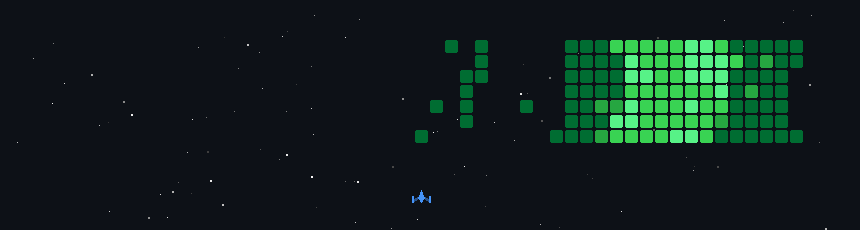

 

 

<pre>
╔══════════════════════════════════════════════════════════════════════════╗
║                       [ PLAYER STATUS SCREEN ]                           ║
╠══════════════════════════════════════════════════════════════════════════╣
║ NAME:  Vishwajeet Vikram Borade    CLASS:  Full-Stack AI Architect       ║
║ LEVEL: 99                          SERVER: India [IN-01]                 ║
║ HP:    ████████████████████ 100%   MANA:   ████████████████░░░░ 80%      ║
║ EXP:   ██████████████████▓▓ 95%    GUILD:  LFG (Hard problems & Scale)   ║
╠══════════════════════════════════════════════════════════════════════════╣
║ PASSIVE ABILITY: [Relentless Builder]                                    ║
║ Forges full, scalable ecosystems from scratch. Immune to tutorial hell.  ║
║ Specializes in Fintech, Game Infrastructure, InfoSec, and AI Integration.║
╚══════════════════════════════════════════════════════════════════════════╝
</pre>

  
  
  
  

  

<h2 align="center">📜 <code>ACTIVE MAIN QUESTS</code></h2>

<table>
<tr>
<td width="50%" valign="top">
<pre>
┌───────────────────────────────────┐
│ QUEST: Project Nexus              │
│ TYPE:  Epic Infrastructure        │
├───────────────────────────────────┤
│ Build a massive multiplayer game  │
│ backend platform. Must support    │
│ high concurrency and inject       │
│ AI-native NPCs seamlessly.        │
│                                   │
│ [REWARDS] Python, FastAPI, React  │
│ [STATUS]  In Progress...          │
└───────────────────────────────────┘
</pre>
</td>
<td width="50%" valign="top">
<pre>
┌───────────────────────────────────┐
│ QUEST: Echoes of Truth            │
│ TYPE:  Legendary Simulation       │
├───────────────────────────────────┤
│ Prove the Nexus architecture by   │
│ building an interrogation game.   │
│ AI suspects must dynamically adapt│
│ to psychological pressure.        │
│                                   │
│ [REWARDS] Nexus Engine, AI Logic  │
│ [STATUS]  Co-development...       │
└───────────────────────────────────┘
</pre>
</td>
</tr>
</table>

 

<h2 align="center">⚔️ <code>INVENTORY & ARSENAL (PROJECTS)</code></h2>

<table>
<tr>
<td width="50%" valign="top">

### 🛡️ [Mythic Shield] SentinelX
**Enterprise Anti-Cheat Infrastructure**
*Forged for high-concurrency Unreal Engine/Unity.*
- **Lore:** Built to stop speedhacks and aim-snapping.
- **Stats:** Zero-allocation native SDK (`<0.1ms` overhead). Lockless ring buffer design.
- **Enchantment:** HMAC-SHA256 signed telemetry.
- **Weaponry:**   

</td>
<td width="50%" valign="top">

### 🔮 [Epic Relic] AlphaScope
**Dual-Signal Intelligence Terminal**
*High-conviction market trade setups.*
- **Lore:** Cross-validates two independent algorithms to eliminate false positives in the market.
- **Stats:** Live NSE telemetry & Groq AI-powered market briefs. Serverless auto-scaling.
- **Enchantment:** Dual-Agent fusion engine.
- **Weaponry:**  

</td>
</tr>
<tr>
<td width="50%" valign="top">

### ⚔️ [Rare Blade] NSE Trading System
**AI Trading Terminal**
*Semi-autonomous terminal for Indian Markets.*
- **Lore:** Blends rule-based technical analysis with heavy ML predictions.
- **Stats:** Random Forest trained on 15 years of NSE historical data.
- **Enchantment:** VADER NLP live sentiment analysis.
- **Weaponry:**  

</td>
<td width="50%" valign="top">

### 🤖 [Summoning Scroll] Claude Code Studios
**Orchestration Simulation**
*48 AI Agents forming a game studio.*
- **Lore:** Turns Claude Code into a complete autonomous game development studio.
- **Stats:** 36 distinct workflow skills mimicking real studio hierarchies.
- **Enchantment:** Total agent coordination layer.
- **Weaponry:** 

</td>
</tr>
</table>

<b>[ CLICK TO OPEN BACKPACK FOR MORE ITEMS ]</b>

 
<pre>
📦 ITEM: StockFlow (Enterprise Inventory Management)
- STATS: Full-stack, 2FA, JWT rotation, Docker, Native Windows .exe

💳 ITEM: Payment Webhook API (Secure Integration)
- STATS: Razorpay, Spring Boot, PostgreSQL, Webhook syncing

🛡️ ITEM: CyberShield AI (Threat Intelligence)
- STATS: AI-driven cyber dashboard, TS/Python, Threat prediction
</pre>

  

<h2 align="center">🌳 <code>SKILL TREE UNLOCKED</code></h2>

<pre>
[ CORE MAGIC (LANGUAGES) ]
[ Python ] ── [ TypeScript ] ── [ JavaScript ] ── [ C++ ] ── [ Go ] ── [ Java ]

[ HEAVY ARMOR (BACKEND & SYSTEMS) ]
[ FastAPI ] ── [ Node.js ] ── [ Spring Boot ] ── [ Docker ] ── [ GitHub Actions ]

[ ILLUSION ARTS (FRONTEND) ]
[ React ] ── [ Vite ] ── [ Tailwind CSS ]

[ DATA VAULTS & SUMMONING (DB & AI) ]
[ PostgreSQL ] ── [ Kafka ] ── [ ClickHouse ] ── [ Scikit-Learn ] ── [ ONNX ]
</pre>

 

<h2 align="center">🏆 <code>TROPHY ROOM & STATS</code></h2>

<pre>
[ ACHIEVEMENTS UNLOCKED ]
🏆 [Godlike] ET AI Hackathon 2026 - Won PS6 (AI for Indian Investor)
🏆 [Epic]    Sunmount Solutions   - Dominated Web/App Category
</pre>

  

  

<h2 align="center">👾 <code>FINAL BOSS MINIGAME</code></h2>

*Warning: A massive alien fleet is approaching your contribution graph!*  

  

